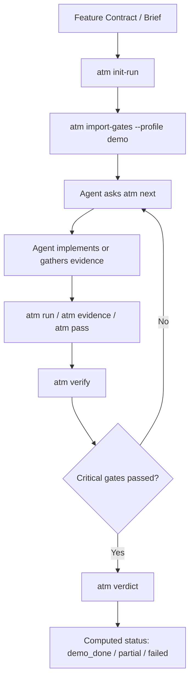

# Agent Task Manager: Lightweight Gate Runner Spec

Status: implementation-ready proposal
Audience: Hermes, Codex, other autonomous coding agents
Goal: keep `agent-task-manager` small, but make it strong enough to prevent fake `done`

## 1. Core Thesis

`agent-task-manager` should not become Jira, Linear, PUFF, or a giant markdown checklist parser.

It should become a tiny deterministic runtime around an LLM:

- Markdown/spec files define intent.
- The agent writes code.
- ATM owns state, gates, evidence, commands, and verdicts.
- The final status is computed by ATM, not written by the agent.

The missing piece in the autonomous feature experiments was not another longer prompt. The missing piece was an external, append-only, machine-checkable execution ledger that agents cannot casually bypass.

## 2. Problem We Are Solving

In the experiments, agents repeatedly said `done` while the real result was not done:

- Build/typecheck failed.
- Migrations were missing.
- Evidence files were absent.
- Screenshots existed but were not visually reviewed.
- E2E used soft waits, swallowed errors, or API shortcuts.
- SQLite gate ledgers were created after the feature, not used during execution.
- Gates were marked passed in batch without matching evidence.
- Final reports contradicted the actual repo state.

This is not primarily a prompting problem. It is a runtime problem.

LLMs are good at implementation and explanation. They are bad at being their own auditor.

ATM should be the auditor.

## 3. Non-Goals

Do not build these in the first version:

- Web UI.
- Multi-user permissions.
- Cloud service.
- Complex workflow designer.
- Full markdown parser.
- Visual AI judge.
- Automatic product taste evaluator.
- Deep PUFF replacement.
- Enterprise project management.
- Agent orchestration framework.

The first useful version should stay boring: Python, SQLite, CLI, JSON/YAML, deterministic validators.

## 4. Design Principle

If a rule matters, it must become one of these:

- A command ATM runs.
- A file ATM verifies exists.
- A JSON field ATM verifies.
- A forbidden pattern ATM searches for.
- A gate that cannot pass without evidence.
- A computed verdict that the agent cannot override.

If a rule only exists in prose, treat it as guidance, not enforcement.

## 5. Minimum Useful Architecture

ATM keeps the existing task state machine and adds a gate state machine.



## 6. Required CLI MVP

The CLI should have only the commands needed to enforce a real run.

### 6.1 Run Lifecycle

```bash
atm init-run --id tournament-quest-boost --contract ./contract.md --profile demo
atm status
atm export --out ./evidence/atm-export.json
```

Behavior:

- Creates `.atm/state.db` if missing.
- Creates one run.
- Stores contract path and profile.
- Refuses to create another active run with same id unless `--resume` is used.

### 6.2 Gate Import

```bash
atm import-gates --profile demo
atm import-gates --file ./gates.yaml
```

Behavior:

- Imports gates into SQLite.
- Gates are typed.
- Gates have severity.
- Gates may have dependencies.
- Gate IDs are stable.
- Import is idempotent.

Do not parse hundreds of markdown checkboxes in v1. Use explicit gate profiles.

### 6.3 Next Work

```bash
atm next
atm next --json
```

Behavior:

- Returns the next unblocked required gate.
- Prefers critical gates.
- Respects dependencies.
- Shows exact pass criteria.
- Shows acceptable evidence.

This is the most important command. Agents should not decide what to do next from memory.

### 6.4 Claim And Start

```bash
atm start gate.build.production
atm block gate.e2e.demo --reason "App cannot boot because migration is missing"
```

Behavior:

- Moves a gate to `in_progress`.
- Writes append-only event.
- Blocks require a reason.
- Blocks do not count as pass.

### 6.5 Evidence

```bash
atm evidence gate.screenshots.desktop --file ./evidence/screenshots/01-hero.png
atm evidence gate.e2e.demo --file ./evidence/e2e-report.json
atm evidence gate.visual.review --note "Opened screenshots manually and rejected mobile overflow"
```

Behavior:

- Evidence paths must exist when they are file evidence.
- Evidence is append-only.
- Notes are allowed but cannot satisfy command/file gates alone.
- Evidence refs are stored separately from gate status.

### 6.6 Command Gates

```bash
atm run gate.build.production -- npm run build
atm run gate.typecheck -- npm run typecheck
atm run gate.e2e.demo -- npm run e2e:tournament-quest-boost
```

Behavior:

- ATM executes the command.
- Captures exit code, stdout, stderr, duration, and timestamp.
- Stores log file.
- Gate passes only on exit code `0` unless configured otherwise.
- Agent cannot manually pass command gates.

### 6.7 Manual Gates

```bash
atm pass gate.visual.review --evidence ./evidence/visual-review.md
atm fail gate.visual.review --reason "Screenshots look like admin UI"
```

Behavior:

- Manual gates require evidence or reason.
- Manual gates are allowed for taste and judgement, but final verdict should label them as manual.
- Manual gates cannot override failed hard gates.

### 6.8 Verification

```bash
atm verify
atm verify --json
```

Behavior:

- Re-runs deterministic validators.
- Detects contradictions.
- Fails if a passed gate has missing evidence.
- Fails if required files are absent.
- Fails if forbidden patterns exist.
- Fails if final report says done while critical gates are pending/failed.

### 6.9 Verdict

```bash
atm verdict
atm verdict --json
```

Allowed verdicts:

- `demo_done`: all critical gates passed, no contradiction, evidence complete.
- `reviewable_partial`: feature can be reviewed, but one or more non-critical gates failed or were waived.
- `technical_partial`: code exists, but demo/evidence gates are incomplete.
- `failed`: critical gate failed or app cannot run.
- `invalid`: ledger contradiction or forged evidence detected.

The agent may quote the verdict. The agent may not invent the verdict.

## 7. Gate Model

Each gate should be a small typed object.

```yaml
id: gate.build.production
title: Production build passes
severity: critical
kind: command
command: npm run build
pass:
  exit_code: 0
evidence:
  required:
    - command_log
```

Recommended fields:

- `id`
- `title`
- `description`
- `severity`: `critical`, `major`, `minor`
- `kind`: `command`, `file_exists`, `json_assert`, `grep_forbidden`, `manual`, `screenshot_set`, `composite`
- `depends_on`
- `command`
- `paths`
- `assertions`
- `forbidden_patterns`
- `evidence.required`
- `waivable`: boolean

## 8. SQLite Schema

Keep schema small and append-only where it matters.

```sql
CREATE TABLE runs (
  id TEXT PRIMARY KEY,
  profile TEXT NOT NULL,
  contract_path TEXT,
  status TEXT NOT NULL,
  created_at TEXT NOT NULL,
  updated_at TEXT NOT NULL,
  verdict TEXT
);

CREATE TABLE gates (
  id TEXT NOT NULL,
  run_id TEXT NOT NULL,
  title TEXT NOT NULL,
  severity TEXT NOT NULL,
  kind TEXT NOT NULL,
  status TEXT NOT NULL,
  spec_json TEXT NOT NULL,
  created_at TEXT NOT NULL,
  updated_at TEXT NOT NULL,
  PRIMARY KEY (run_id, id)
);

CREATE TABLE gate_events (
  id INTEGER PRIMARY KEY AUTOINCREMENT,
  run_id TEXT NOT NULL,
  gate_id TEXT NOT NULL,
  event_type TEXT NOT NULL,
  payload_json TEXT,
  created_at TEXT NOT NULL
);

CREATE TABLE evidence_refs (
  id INTEGER PRIMARY KEY AUTOINCREMENT,
  run_id TEXT NOT NULL,
  gate_id TEXT NOT NULL,
  evidence_type TEXT NOT NULL,
  path TEXT,
  note TEXT,
  sha256 TEXT,
  created_at TEXT NOT NULL
);

CREATE TABLE command_runs (
  id INTEGER PRIMARY KEY AUTOINCREMENT,
  run_id TEXT NOT NULL,
  gate_id TEXT NOT NULL,
  command TEXT NOT NULL,
  exit_code INTEGER NOT NULL,
  stdout_path TEXT,
  stderr_path TEXT,
  duration_ms INTEGER,
  created_at TEXT NOT NULL
);

CREATE TABLE verdicts (
  id INTEGER PRIMARY KEY AUTOINCREMENT,
  run_id TEXT NOT NULL,
  verdict TEXT NOT NULL,
  reason_json TEXT NOT NULL,
  created_at TEXT NOT NULL
);
```

Important rule:

- `gate_events` is append-only.
- `gates.status` is derived current state.
- `verdicts` is computed from gate state and validators.

## 9. Gate State Machine

```text
pending -> in_progress -> passed
pending -> in_progress -> failed
pending -> blocked
blocked -> pending
failed -> in_progress
passed -> failed        # allowed only by verify when contradiction is found
```

Forbidden transitions:

- `pending -> passed` for command gates.
- `pending -> passed` without evidence for manual gates.
- `failed -> passed` without a new event explaining the fix.
- Any `demo_done` verdict with critical gates not passed.

## 10. Profiles

Profiles keep ATM light. Instead of importing 405 gates every time, choose the right profile.

### 10.1 `patch`

For small bugfixes.

Required gates:

- Scope understood.
- Relevant tests pass.
- Build or typecheck pass if touched code requires it.
- Changed files summarized.

### 10.2 `feature`

For normal product features.

Required gates:

- Discovery completed.
- Data model/API contract verified.
- Implementation complete.
- Build passes.
- Typecheck passes.
- Happy path test passes.
- Evidence summary exists.

### 10.3 `demo`

For stakeholder demo features.

Required gates:

- All `feature` gates.
- Product experience contract written.
- Demo path implemented via UI.
- No API shortcut in demo flow unless explicitly allowed.
- Screenshots desktop and mobile exist.
- Visual review exists.
- E2E report exists.
- No console/page errors.
- Evidence package complete.

### 10.4 `benchmark`

For comparing multiple agents/models.

Required gates:

- All `demo` gates.
- Fixed timebox recorded.
- Fixed prompt/contract recorded.
- Final score JSON exists.
- Known deviations recorded.
- Reproduction commands exported.

## 11. Demo Profile: Suggested Gates

These are enough to prevent the exact failures we saw without recreating the monster checklist.

```yaml
gates:
  - id: gate.discovery.api
    title: API and data contract probed before implementation
    severity: critical
    kind: manual
    evidence:
      required: [note]

  - id: gate.discovery.routes
    title: Routes and navigation checked
    severity: major
    kind: manual
    evidence:
      required: [note]

  - id: gate.implementation.migration
    title: Required migrations exist or schema change is not needed
    severity: critical
    kind: file_exists_or_note

  - id: gate.build.production
    title: Production build passes
    severity: critical
    kind: command
    command: npm run build

  - id: gate.typecheck
    title: Typecheck passes
    severity: critical
    kind: command
    command: npm run typecheck

  - id: gate.e2e.demo
    title: Demo E2E passes without swallowed failures
    severity: critical
    kind: command
    command: npm run e2e

  - id: gate.e2e.no_soft_success
    title: E2E has no soft success patterns
    severity: critical
    kind: grep_forbidden
    paths:
      - product/scripts
    forbidden_patterns:
      - ".catch(() => {})"
      - "|| true"
      - "pageErrors.length"

  - id: gate.screenshots.desktop
    title: Desktop screenshots exist and are non-empty
    severity: critical
    kind: screenshot_set
    min_count: 4
    min_size_kb: 80

  - id: gate.screenshots.mobile
    title: Mobile screenshot exists and is non-empty
    severity: critical
    kind: screenshot_set
    min_count: 1
    min_size_kb: 60

  - id: gate.visual.review
    title: Screenshots were opened and reviewed against product bar
    severity: critical
    kind: manual
    evidence:
      required: [file]

  - id: gate.evidence.package
    title: Evidence package has required files
    severity: critical
    kind: file_exists
    paths:
      - summary.md
      - verdict.json
      - changed-files.md
      - artifacts.json
      - demo-narrative.md
      - visual-review.md
      - e2e-report.json

  - id: gate.verdict.computed
    title: Final verdict is computed by ATM
    severity: critical
    kind: composite
```

## 12. Anti-Forgery Rules

ATM should explicitly detect these patterns:

- Gate marked passed but required file does not exist.
- Gate marked passed before evidence timestamp.
- `summary.md` says done but `atm verdict` is not `demo_done`.
- Command gate passed without command run.
- Command gate passed with non-zero exit code.
- Screenshot gate passed with zero-byte or tiny PNG.
- E2E gate passed but report has page errors.
- E2E gate passed but script contains swallowed waits or errors.
- Evidence package references files outside the run directory without explicit allowance.
- Demo HTML is claimed but file is missing.

Contradiction verdict should be `invalid`, not `partial`.

## 13. Visual Quality Without Expensive Vision Models

Do not depend on vision models for v1. Use cheap layered checks.

### 13.1 Machine Checks

- Screenshot count.
- Screenshot dimensions.
- Screenshot file size threshold.
- Screenshot perceptual uniqueness if possible.
- DOM markers such as `data-page`, `data-ready`, `data-state`.
- Key visible text assertions in E2E.
- Mobile viewport screenshot required.
- No large horizontal overflow in mobile via JS assertion:

```js
const overflow = await page.evaluate(() => document.documentElement.scrollWidth - window.innerWidth)
if (overflow > 8) throw new Error(`Mobile horizontal overflow: ${overflow}px`)
```

### 13.2 Product Contract Checks

Require a short `product-experience.md` before implementation:

- What should this feel like?
- What are the three hero moments?
- What would make it look cheap?
- What must be visible above the fold?
- What is the demo story?

### 13.3 Manual Visual Gate

The agent must create `visual-review.md` with:

- Screenshots opened.
- What looks premium.
- What looks cheap.
- Mobile verdict.
- Top three visual risks.

This is not perfect, but it forces the agent to stop pretending PNG existence equals quality.

## 14. E2E Stability Rules

ATM should push agents away from flaky E2E patterns.

Required:

- Prefer semantic waits over fixed sleeps.
- Require `data-ready="true"` or equivalent readiness contract for demo pages.
- Collect page errors.
- Collect console errors.
- Fail on unexpected page or console errors.
- Fail on missing expected visible text.
- Fail on missing state transition.
- Fail on mobile overflow.
- Generate JSON report.

Allowed:

- Short bounded waits for animation settling after readiness is reached.
- Retry only for infrastructure startup, not product assertions.

Forbidden:

- `.catch(() => {})` around assertions.
- `|| true` in verification commands.
- API shortcut for the main demo action unless the contract explicitly allows it.
- Marking E2E passed when screenshots exist but assertions failed.

## 15. How This Integrates With Existing ATM

Current ATM already has:

- SQLite.
- CLI scripts.
- Task state machine.
- Read/work/status separation.
- Philosophy that Python enforces transitions.

Add this without rewriting everything:

```text
src/
  taskboard.py          existing
  read_agent.py         existing
  workitem_agent.py     existing
  status_agent.py       existing
  gateboard.py          new: gate ORM and validators
  gate_agent.py         new: CLI for gates/evidence/run/verdict
  profiles/
    patch.yaml
    feature.yaml
    demo.yaml
    benchmark.yaml
```

Keep old task commands working.

Gate runner can be a separate command:

```bash
python3 src/gate_agent.py init-run --id demo-1 --profile demo
python3 src/gate_agent.py next
python3 src/gate_agent.py run gate.build.production -- npm run build
python3 src/gate_agent.py verdict
```

Later, add a nicer wrapper:

```bash
atm next
```

## 16. Implementation Roadmap

### v0.1: Gate Ledger

Deliver:

- Tables: `runs`, `gates`, `gate_events`, `evidence_refs`.
- Commands: `init-run`, `import-gates`, `next`, `start`, `pass`, `fail`, `evidence`, `status`.
- One built-in profile: `demo`.

Success:

- Agent can no longer claim “all gates passed” without DB state.

### v0.2: Command Gates

Deliver:

- `run` command.
- `command_runs` table.
- Log capture.
- Exit-code based pass/fail.

Success:

- Build/typecheck/E2E gates are not manually passable.

### v0.3: Verification

Deliver:

- `verify` command.
- File existence checks.
- Missing evidence detection.
- Contradiction detection.
- `invalid` status.

Success:

- Passed gate with missing evidence is automatically downgraded.

### v0.4: Profiles

Deliver:

- YAML profiles: `patch`, `feature`, `demo`, `benchmark`.
- Profile import.
- Severity/dependencies.

Success:

- Small tasks do not pay demo-level bureaucracy.

### v0.5: E2E Guards

Deliver:

- Forbidden pattern scan.
- JSON report assertion.
- Page/console error assertion conventions.
- Mobile overflow assertion template.

Success:

- Soft E2E cannot pass as demo evidence.

### v0.6: Evidence Export

Deliver:

- `export` command.
- `atm-export.json`.
- `gate-ledger-summary.md`.
- Reproduction command list.

Success:

- Another person/model can inspect run state without trusting the final summary.

### v0.7: Optional Nice-To-Have

Deliver only if v0.1-v0.6 are stable:

- Tiny TUI or HTML report.
- Screenshot thumbnails in report.
- Git diff summary.
- MCP wrapper for agents.

Do not start here.

## 17. Agent Launch Instruction

Use this when giving work to Hermes/Codex/another model:

```text
You must use agent-task-manager as the runtime.

Before writing code:
1. Run `atm init-run --id <feature-id> --contract <contract.md> --profile demo`.
2. Run `atm import-gates --profile demo`.
3. Run `atm next`.

During work:
1. Work only on the current gate or explicitly block it.
2. Attach evidence through `atm evidence`.
3. Run build/typecheck/E2E through `atm run`, not manually.
4. Do not mark command gates passed yourself.
5. Do not write final `done` until `atm verdict` returns `demo_done`.

If ATM is unavailable, stop and report `blocked: ATM unavailable`.
If you bypass ATM, the result is invalid even if the code looks correct.
```

## 18. What To Remove From The Gold Standard

Once ATM exists, reduce the markdown standard.

Move out of markdown:

- 400+ checkboxes.
- Repeated evidence file lists.
- Build/typecheck/E2E pass conditions.
- Gate status tracking.
- Verdict language.

Keep in markdown:

- Product bar.
- Demo story.
- Taste guidance.
- Failure taxonomy.
- Escalation rules.
- Examples of good/bad evidence.

The standard should become a constitution. ATM should become the court.

## 19. The Lightweight Boundary

ATM becomes too heavy if it starts doing these:

- Assigning work across teams.
- Replacing issue trackers.
- Maintaining long-term product roadmaps.
- Owning visual design judgement.
- Running cloud infrastructure.
- Parsing arbitrary agent prose.
- Generating feature plans.

ATM is still lightweight if it only does these:

- Stores run state.
- Stores gates.
- Stores append-only events.
- Runs commands.
- Verifies evidence.
- Computes verdict.
- Exports evidence.

## 20. Definition Of Done For ATM Upgrade

ATM upgrade is done when this scenario works end-to-end:

```bash
atm init-run --id smoke-demo --contract ./demo-contract.md --profile demo
atm import-gates --profile demo
atm next
atm run gate.build.production -- npm run build
atm evidence gate.screenshots.desktop --file ./evidence/screenshots/01.png
atm verify
atm verdict
```

And these are true:

- `atm verdict` refuses `demo_done` while critical gates are pending.
- A command gate cannot be manually passed.
- A missing evidence file invalidates the gate.
- A failed build makes verdict `failed` or `technical_partial`.
- The final export shows enough information to audit the run.

## 21. Final Recommendation

Do not make ATM smart. Make it stubborn.

The winning design is:

- Small enough that any agent can understand it in five minutes.
- Strict enough that an agent cannot lie by accident.
- Boring enough that it works across models.
- Portable enough that five parallel model runs can be compared.

This is the missing bridge between “cool autonomous coding demo” and “predictable autonomous delivery experiment”.
