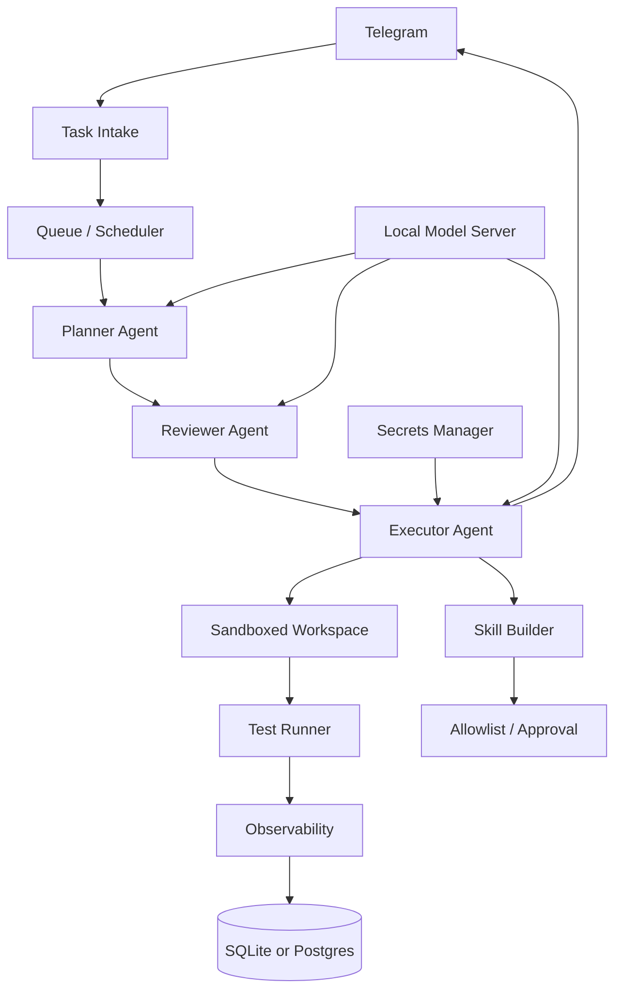

# Target Architecture

## Design principles

The architecture should be boring in the best possible way:

- safe by default
- reproducible
- observable
- cheap to run
- easy to roll back
- hard to destroy files
- easy to audit later

The system should support self-improvement, but only through explicit gates.

This architecture sits under the `Fantasy Casino as Agentic Stress Test` umbrella, so every design choice should support one of four goals:

- safer autonomy
- better observability
- stronger product realism
- higher personal leverage and visibility

## Core layers

## 1. Control plane

Telegram should be the human interface for the system:

- new task submission
- status updates
- approval requests
- test results
- rollback alerts

If Telegram is the front door, then every task becomes traceable and every escalation becomes visible.

## 2. Orchestration plane

Use a simple multi-step loop first:

- planner
- reviewer
- executor
- verifier

That is enough for most work. A more complex swarm model should be postponed until the base loop is reliable.

Suggested rule:

- planner may propose
- reviewer may reject
- executor may change files
- verifier may run tests
- only the human may approve risky merges

## 3. Model serving plane

For the MacBook Pro M5 48 GB target, the local model layer should be lightweight and practical.

Recommended direction:

- primary coding / planning model: Qwen3 dense class in a quantized local setup
- optional smaller helper model: used for drafts, summaries, or tool-call planning
- local runtime: MLX first for Apple-native experiments, with a fallback path for llama.cpp-style serving if needed

The current official Qwen3 docs explicitly mention local running with frameworks such as llama.cpp, Ollama, and LM Studio. That is a good sign that the family is suitable for this kind of setup.

## 4. Workspace safety

This part is non-negotiable.

The agent should never directly delete files. Instead:

- every “delete” becomes a move to a quarantine/trash folder
- every write happens in an isolated workspace
- every risky operation requires an approval token
- every command is logged
- every tool call is attributed to an agent role

Recommended implementation pattern:

- `workspace/` for active edits
- `trash/` for moved files
- `snapshots/` for pre-change state
- `artifacts/` for test results and logs

## 5. Execution sandbox

The safest baseline is containerized execution with strict permissions.

Minimum controls:

- read-only mount of the source tree where possible
- writable scratch directory only
- no access to host secrets
- network egress allowlist
- resource limits on CPU, RAM, and runtime
- separate browser sandbox for web automation

If a stronger isolation layer is available later, it can be added as an upgrade. But the first milestone should work inside a practical Docker-based isolation model.

## 6. Skills subsystem

The skill system should be additive, not chaotic.

Recommended behavior:

- scan the repository
- detect stack and needs
- install only skills relevant to the current project
- keep skill generation behind review
- store generated skills in a separate directory
- activate skills only after they pass a human approval gate

`midudev/autoskills` is useful as a bootstrapper because it detects the stack and installs matching skills automatically. But automatic installation should be constrained by allowlists and review, not treated as a free pass for self-modification.

## 7. Observability

The agent needs a proper event log from day one.

Minimum schema:

- session id
- agent role
- timestamp
- prompt token count
- completion token count
- total token count
- cached token count
- TTFT
- generation time
- tokens per second
- prompt hash
- response hash
- tool call errors
- test result
- approval result
- filesystem diff summary

The main point is not just “what did the model say”. It is “what did the system do, how expensive was it, and how often did it repeat itself”.

## 8. Secret handling

Secrets should be separated from the agent runtime.

Recommended approach:

- Infisical or an equivalent secret manager
- no raw tokens in prompts
- no raw tokens in logs
- scoped access per tool
- short-lived credentials where possible

## 9. Browser automation

The browser automation layer should be treated as a tool, not a privilege.

Practical starting point:

- one browser process per task or small task batch
- limited concurrency
- explicit page navigation limits
- screenshots only when needed
- no background browsing unless requested

The “best browser” claim should be validated against actual local benchmarks before becoming a dependency.

## 10. Data storage for agent memory

Use two storage layers:

- SQLite for local simplicity and fast iteration
- Postgres when the system becomes multi-user or needs stronger reporting

Suggested split:

- SQLite for early prototyping, replay, and local debugging
- Postgres for long-term analytics, dashboards, and team access

## Current read on model choices

The current evidence suggests this ranking:

1. MLX for Apple-native experimentation and fast iteration.
2. Qwen3 dense-class models for strong local coding performance.
3. llama.cpp-style serving for portability and ecosystem compatibility.
4. Experimental accelerators only after a benchmark proves they help more than they complicate.

## What stays experimental

The following ideas are interesting, but not yet foundational:

- Obscura
- Hermes agents
- dflash
- any fully autonomous self-evolving loop without review gates

The model policy should also stay pragmatic: local-first by default, frontier models allowed when they materially improve the outcome.

Until verified, these should be treated as candidates, not assumptions.
