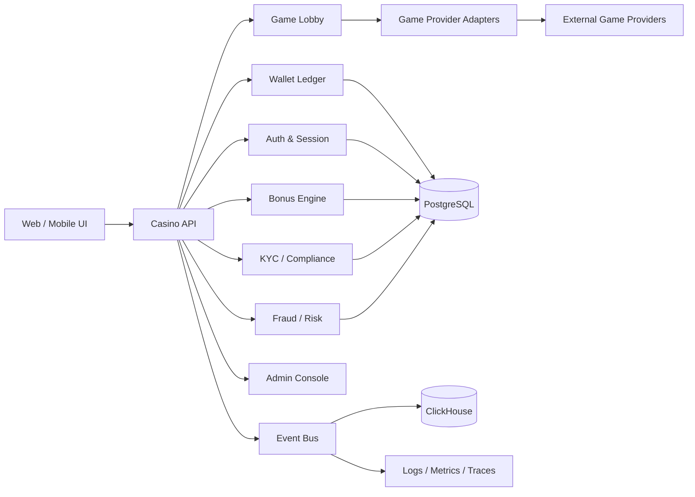

# Technical Plan: Building the Casino Runtime

## Guiding principle

Build the casino as a money-moving transactional platform first, and only then connect it to the analytics and local-agent layer described in the repository.

This runtime is the product-side half of the broader `Fantasy Casino as Agentic Stress Test` experiment.

## Recommended system shape

Start with a modular monolith for the core product and surround it with specialized services.

The agentic layer should not sit inside this core. It should observe, assist, and verify, but not become the transactional source of truth.

## Core domains

### 1. Identity and access

This is the foundation for everything else.

Must-haves:

- registration
- login
- MFA if required by jurisdiction
- device/session tracking
- IP and geo enrichment
- account recovery
- account lock and self-exclusion

Data alignment:

- `dim_players`
- `player_registration_completed`
- `player_kyc_completed`
- `player_self_excluded`

### 2. Wallet and cashier

This is the most sensitive domain because it moves real money.

Must-haves:

- player balance ledger
- deposits
- withdrawals
- holds and releases
- refunds
- chargeback handling
- transaction idempotency
- reconciliation jobs

Implementation rule:

- never update balance as a single mutable number without a ledger entry
- every financial action should be append-only and auditable

Data alignment:

- `fct_deposits`
- `fct_withdrawals`
- `fct_bets`
- `fct_bonuses`
- `player_deposit_completed`
- `player_withdrawal_requested`

### 3. Game session and round flow

This is the casino-specific product loop.

Must-haves:

- lobby browsing
- game launch
- round creation
- round settlement
- RTP tracking
- provider status tracking
- error handling for interrupted sessions

Data alignment:

- `dim_games`
- `game_type`
- `provider`
- `rtp_theoretical`
- `player_game_launched`
- `player_bet_placed`
- `player_bet_settled`

### 4. Bonus and promo engine

Bonuses are not just marketing. They are part of the financial model.

Must-haves:

- welcome bonus
- cashback
- free spins
- wagering requirements
- bonus eligibility rules
- bonus abuse prevention
- bonus redemption and expiry

Data alignment:

- `fct_bonuses`
- `player_bonus_issued`
- `player_promo_redeemed`
- bonus cost and bonus cost ratio metrics

### 5. Risk and responsible gaming

This should be built early, not as a later add-on.

Must-haves:

- AML / fraud scoring
- velocity checks
- multi-account detection
- device fingerprinting
- limit management
- self-exclusion
- reality check reminders

Data alignment:

- `is_self_excluded`
- fraud model
- churn and risk segmenting
- `player_self_excluded`

### 6. Compliance and KYC

The product will not be safe without a compliance flow.

Must-haves:

- KYC submission
- verification state machine
- document review
- manual escalation
- jurisdiction-based access restrictions

Data alignment:

- `kyc_status`
- `player_kyc_completed`
- masked views for non-compliance roles

### 7. Analytics and telemetry

This repo is already very strong here, so reuse it as the contract.

Must-haves:

- event taxonomy
- raw event capture
- ClickHouse analytics store
- dbt models
- dashboards
- incident alerts

Data alignment:

- `fct_events_raw`
- `mart_daily_kpi`
- `mart_game_performance`
- `mart_marketing_performance`
- `mart_player_lifetime`

## Storage strategy

Use three distinct persistence layers.

### PostgreSQL

Primary OLTP database for:

- accounts
- wallet ledger
- bonuses
- KYC
- admin actions
- audit trail

### Event bus

Used for:

- game events
- payment events
- compliance events
- risk events

### ClickHouse

Used for:

- product analytics
- RTP and provider analytics
- business dashboards
- experimentation
- cohort analysis

This matches the direction implied by `data-architecture.html`, `data-model.html`, and `dashboards.html`.

## API surface

Minimum set of internal APIs:

- `POST /auth/register`
- `POST /auth/login`
- `POST /wallet/deposit`
- `POST /wallet/withdraw`
- `POST /wallet/reserve`
- `POST /wallet/settle`
- `GET /games`
- `POST /games/launch`
- `POST /rounds/start`
- `POST /rounds/settle`
- `POST /bonuses/issue`
- `POST /kyc/submit`
- `POST /risk/check`
- `GET /admin/player/:id`
- `GET /admin/ledger/:id`

Every write endpoint must be idempotent.

## Implementation phases

### Phase 1: Ledger and identity

Goal: make the money and player identity model correct before anything pretty exists.

Deliverables:

- PostgreSQL schema
- wallet ledger
- player account lifecycle
- auth/session model
- audit log
- idempotency layer

### Phase 2: Provider integration

Goal: connect one game provider end to end.

Deliverables:

- provider adapter interface
- game launch
- round start/settle
- failure and retry logic
- provider status monitor

### Phase 3: Cashier and KYC

Goal: allow deposits and withdrawals with controlled compliance checks.

Deliverables:

- payment method abstraction
- deposit flow
- withdrawal flow
- KYC state machine
- manual review queue

### Phase 4: Bonus and risk

Goal: protect margin and reduce abuse.

Deliverables:

- bonus rules engine
- wagering requirements
- risk scoring
- self-exclusion enforcement
- bonus abuse analytics

### Phase 5: Analytics contract

Goal: make the product speak the language of the existing repo.

Deliverables:

- event taxonomy implementation
- ClickHouse ingestion
- dbt models
- dashboards
- business metrics

### Phase 6: Operations and automation

Goal: add monitoring, incident handling, and controlled agent-assisted development.

Deliverables:

- structured logs
- traces and metrics
- runbooks
- Telegram notifications
- local agent loop with `gnhf` for non-production engineering tasks

## Suggested stack

### Backend

- TypeScript or Go for the API layer
- PostgreSQL for transactional data
- Redis for session and short-lived cache
- Kafka or Redpanda for event transport

### Analytics

- ClickHouse
- dbt
- Grafana
- Airflow or Dagster

### Product and compliance

- feature flags
- audit logs
- RBAC
- masked views
- approval workflows

### Agentic engineering support

- `gnhf` for long-running repo worktrees and overnight iteration
- local model serving for code review and documentation tasks
- strict sandboxing and no-delete file policy

## Non-negotiable safety controls

1. No direct balance mutation without ledger entries.
2. No provider callback without idempotency keys.
3. No destructive file operations in the agent workspace.
4. No secrets in prompts or logs.
5. No production release without reconciliation and smoke tests.
6. No autonomy for compliance-sensitive changes without human approval.

## How this supports the stress test

The runtime should be complex enough to force the agent system to deal with real product structure:

- regulated money flow
- audit trails
- provider integration
- risk rules
- analytics contracts

If the local agent stack can operate safely in this environment on a laptop, the experiment has real credibility.

## First concrete build target

If the goal is to start producing value quickly, the first milestone should be:

- player auth
- wallet ledger
- one provider adapter
- one game lobby
- one round lifecycle
- one deposit method
- analytics event emission
- one CEO-style ops dashboard

That gives us a real product spine and immediately satisfies the data model and dashboard contract already present in the repository.
