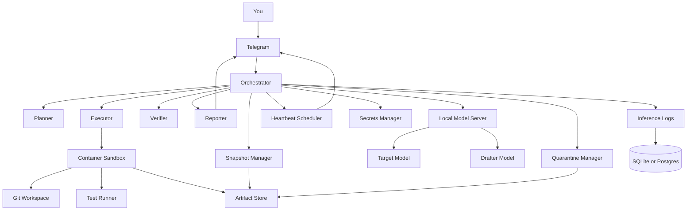

# Component Diagram

This diagram represents the intended operating model for `Fantasy Casino as Agentic Stress Test`.

## Component roles

### Telegram

Human-facing control plane.

### Orchestrator

Decides which role should act next.

### Planner

Splits work into chunks and identifies risk.

### Executor

Makes the actual changes inside the sandbox.

### Verifier

Runs tests and checks whether the patch is coherent.

### Reporter

Creates concise human-readable status messages.

### Snapshot Manager

Stores restore points before risky work.

### Quarantine Manager

Receives files that would otherwise be deleted.

### Local Model Server

Hosts the target model and the drafter.

### Container Sandbox

Enforces isolation and limits the blast radius.

### Heartbeat Scheduler

Sends periodic updates while the laptop is active.

### Inference Logs

Stores timing, token, error, and outcome data.

## Design principle

The diagram should be understood as a workflow, not as a hard dependency graph for day one.

The first useful version can be much smaller, but the final direction should converge toward this shape.

## Model selection note

The local model stack is the baseline, but the orchestrator should be allowed to escalate to stronger models when the task demands it. The experiment is about leverage and control, not about forbidding help.
